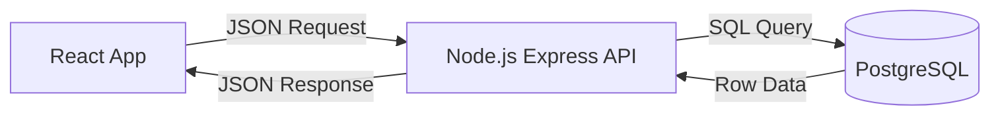

# Detailed Plan: Student Manager (Option B - PERN Stack)

## 1. Overview
**Philosophy**: "The Professional Way". You separate the Display (React) from the Logic (Node.js).
**Why this plan?**: This teaches you the full lifecycle of a web request. It is harder but makes you a "Full Stack Engineer".

---

## 2. Architecture
A classic 3-Tier system. Security is handled by your custom Node server, not the DB.



---

## 3. Tech Stack
| Component | Choice | Reason |
| :--- | :--- | :--- |
| **Frontend** | **React + Vite** | Standard UI library. |
| **Backend** | **Node.js + Express** | Easy to learn, huge community support. |
| **Database** | **PostgreSQL** | The industry standard relational DB. |
| **Hosting** | **Render (Backend) + Vercel (Frontend)** | Best free tier combo. |

---

## 4. Topics to Learn (The Curriculum)

### Frontend (React)
-   [ ] **Axios/Fetch**: Sending HTTP requests (`axios.post('/login')`).
-   [ ] **State Management**: Handling "Loading", "Success", and "Error" states.

### Backend (Node/Express)
-   [ ] **Routing**: `app.get()`, `app.post()`, `app.use()`.
-   [ ] **Middleware**: Functions that run *before* the request hits the route (e.g., `checkLogin`).
-   [ ] **Environment**: `process.env.DB_PASSWORD`.
-   [ ] **CORS**: Configuring who is allowed to talk to your server.

### Database (SQL)
-   [ ] **SQL Syntax**: `SELECT * FROM students WHERE id = $1`.
-   [ ] **Joins**: `SELECT * FROM attendance JOIN students ON ...`.

---

## 5. Potential Problems (And how to solve them)
1.  **CORS Error (The Big One)**:
    *   *Symptom*: Browser says "Access control check failed".
    *   *Fix*: Install `cors` package on backend. `app.use(cors({ origin: 'http://localhost:5173' }))`.
2.  **"Connection Refused"**:
    *   *Cause*: Your Backend isn't running, or you are hitting the wrong port.
    *   *Fix*: Check if Node terminal is running. Check if Frontend is fetch to `localhost:5000` (not 3000).
3.  **Env Variables Undefined**:
    *   *Cause*: You forgot `require('dotenv').config()` at the top of your server file.

---

## 6. Project Structure
You need TWO folders (or a Monorepo).
```text
/student-manager-project
  /client (The React App)
    /src
      /api/axios.js
      /pages...
  /server (The Node App)
    /config/db.js  (Postgres connection)
    /routes
      studentRoutes.js
      authRoutes.js
    /controllers
      studentController.js
    server.js      (Main entry point)
    .env
```

---

## 7. Detailed Roadmap

### Week 1: The Backend (Invisible Work)
-   **Day 1**: Setup Node.js. Create `/server/index.js`. Make it say "Hello".
-   **Day 2**: Connect Postgres. Create `students` table via SQL script.
-   **Day 3**: Create API Routes: `GET /students` and `POST /login`. Test with **Postman**.

### Week 2: The Frontend (Visible Work)
-   **Day 4**: Setup React. Create Sidebar/Login UI.
-   **Day 5**: Connect React to Node. Display the list of students from the API.
-   **Day 6**: Polish. Handle "Wrong Password" errors gracefully.

---

## 8. Hosting Guide (The Triple Deploy)
1.  **Database**: Create project on **Supabase**. Get credentials.
2.  **Backend (Render)**:
    *   Push `/server` folder to GitHub.
    *   New Web Service on Render.
    *   Add Env Var: `DATABASE_URL` (from Supabase).
    *   **Result**: You get `https://my-api.onrender.com`.
3.  **Frontend (Vercel)**:
    *   Push `/client` folder to GitHub.
    *   New Project on Vercel.
    *   Add Env Var: `VITE_API_URL` = `https://my-api.onrender.com`.
    *   **Result**: You get `https://my-app.vercel.app`.

---

## 9. Debugging Tips
-   **Postman**: ALways test your API with Postman first. If it fails there, the bug is in Node. If it works there, the bug is in React.
-   **Server Logs**: Read the terminal where Node is running. It prints the error lines.
-   **Network Tab**: Check the "Response" tab in Chrome DevTools to see what the server actually sent back.
